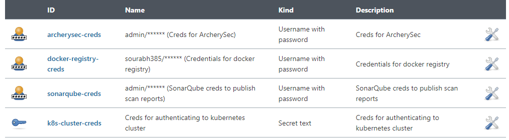

## DevSecOps Pipeline Demo

Jenkins pipeline implementation in this repository:


## Demo Pre-Requisites

- Jenkins Server
- SonarQube Server
- [OWASP Dependency-Check Plugin](https://plugins.jenkins.io/dependency-check-jenkins-plugin) installed in Jenkins
- [Kubernetes CLI Plugin](https://plugins.jenkins.io/kubernetes-cli/) installed in Jenkins
- To build images using Buildah, you need to create one service account and you need to assign it the ability to run as the standard anyuid [SCC](https://docs.openshift.com/container-platform/4.3/authentication/managing-security-context-constraints.html) (See setup below)
- You need authentication to kubernetes cluster (See setup below)
- You need authentication to publish scan reports to SonarQube (See setup below)
- You need authentication to publish scan reports to ArcherySec (See setup below)
- You need authentication to push images to registry and also to pull images for slave pods (See setup below)


## Setup

#### Buildah Setup
```
$ oc create sa buildah-sa

$ oc adm policy add-scc-to-user anyuid -z buildah-sa
```

#### Kubernetes Cluster Authentication

##### Generating Kubernetes credentials

###### Kubernetes Setup

The following example describes how you could use the token of a ServiceAccount to access the Kubernetes cluster from Jenkins. The result depends of course on the permissions you have.

Create a ServiceAccount named `jenkins-robot` in a given namespace.
```
$ kubectl -n <namespace> create serviceaccount jenkins-robot

# The next line gives `jenkins-robot` administator permissions for this namespace.
# * You can make it an admin over all namespaces by creating a `ClusterRoleBinding` instead of a `RoleBinding`.
# * You can also give it different permissions by binding it to a different `(Cluster)Role`.
$ kubectl -n <namespace> create rolebinding jenkins-robot-binding --clusterrole=cluster-admin --serviceaccount=<namespace>:jenkins-robot

# Get the name of the token that was automatically generated for the ServiceAccount `jenkins-robot`.
$ kubectl -n <namespace> get serviceaccount jenkins-robot -o go-template --template='{{range .secrets}}{{.name}}{{"\n"}}{{end}}'
jenkins-robot-token-d6d8z

# Retrieve the token and decode it using base64.
$ kubectl -n <namespace> get secrets jenkins-robot-token-d6d8z -o go-template --template '{{index .data "token"}}' | base64 -d
eyJhbGciOiJSUzI1NiIsImtpZCI6IiJ9.eyJpc3MiOiJrdWJlcm5ldGVzL3NlcnZpY2V[...]
```

On Jenkins, navigate in the folder you want to add the token in, or go on the main page. Then click on the "Credentials" item in the left menu and find or create the "Domain" you want. Finally, paste your token into a Secret text credential. The ID is the credentialsId you need to use in the plugin configuration.

###### OpenShift Setup

Complete kubernetes setup and add below permission to jenkins-robot account

```
$ oc policy add-role-to-user admin system:serviceaccount:<namespace>:jenkins-robot -n <staging_namespace>
$ oc policy add-role-to-user edit system:serviceaccount:<namespace>:jenkins-robot -n <staging_namespace>

$ oc policy add-role-to-user admin system:serviceaccount:<namespace>:jenkins-robot -n <prod_namespace>
$ oc policy add-role-to-user edit system:serviceaccount:<namespace>:jenkins-robot -n <prod_namespace>
```

#### Authentication

Create credentials in Jenkins as shown in below image:



### Note

- If Artillery report is not displayed correctly in Jenkins, then run below script in Script Console in Manage Jenkins page
```
System.setProperty("hudson.model.DirectoryBrowserSupport.CSP", "")
```